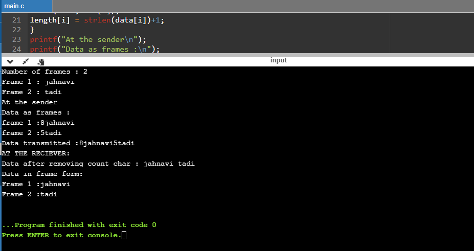
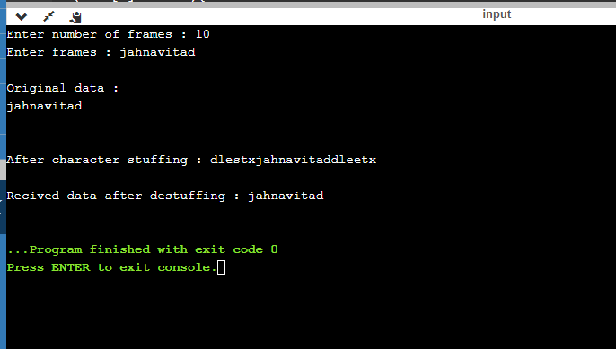

# Experiment 1

## Aim of the Experiment
To impliment data link layer framing techniques such as
i.character count ii.character stuffing and iii. bit stuffing

### Step by step procedure of experiment

#### Character count

1. First scan the number of frames required.
2. Find string length of each frames
3. Print the Frames at Sender.
4. Print  the Data Transmitted.

### Bit stuffing 

1. Bit stuffing is the insertion of non information bits into data. 
2. The stuffed bits should not be confused with overhead bits.
3. Use the two-character sequence 01111110  to signal the beginning of a frame, and the sequence 01111110 to flag the frame's end.
4. Use character stuffing within the frame. 
5. Replace every occurrence of 11111 with the 0

### Character stuffing

1. Use the two-character sequence DLE STX (Data Link Escape, Start of TeXt) to signal the beginning of a frame, and the sequence DLE ETX (End of TeXt) to flag the frame's end.
2. Use character stuffing within the frame.
3. Replace every occurrence of DLE with the two-character sequence DLE DLE.
4. The receiver reverses the processes, replacing every occurrence of DLE DLE with a single DLE.

### Output

#### Character count:

#### Bit stuffing:

#### Character stuffing:

